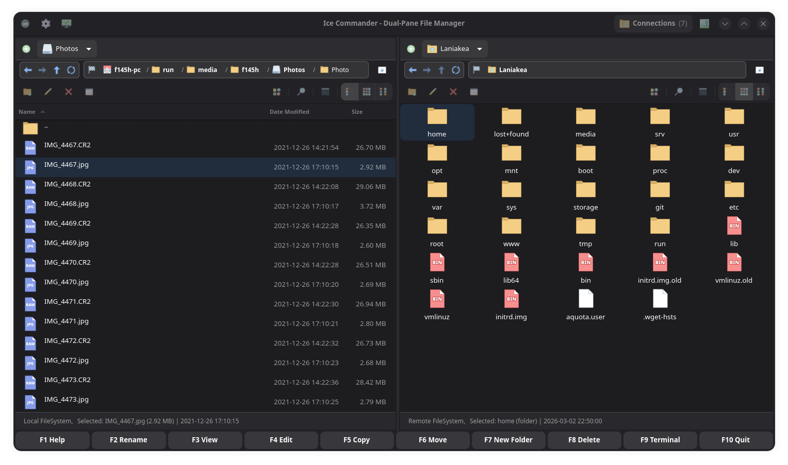

# Ice Commander

A cross-platform dual-pane file manager — Linux, macOS and Windows. Written in Rust with
GTK4 and libadwaita.

Two panels side by side, keyboard-first, with the function keys where a two-pane manager
puts them. Copy and move run between the panels whatever each side is — a local disk, a
server, an archive — with progress, skip and retry.

**No GPL code ships.** The project is MIT OR Apache-2.0, and the bundles carry no GPL
library on any platform — the two the GTK stack drags in are replaced by our own MIT
stand-ins.

## Current state of the project

**0.7 was the last monolithic build.** It is kept as it is — take it if you want a file
manager that simply works.

**0.8 is under active development.** The application keeps the panels, the copy engine, the
viewer and the keyboard, and knows one filesystem — the local disk. The rest is plugins,
switched on in **Settings → Plugins**:

- **filesystems** — archives, FTP, SFTP, WebDAV, torrent, peer-to-peer between your own devices etc
- **viewers** — images, PDF, camera raw, audio, video
- **tools** — processes, system information, developer tools, registry

An SDK is being prepared, and more of what is still built in will move out. Until then a
feature whose plugin is not installed is simply absent, and the plugin interface still
changes between releases — sorry for the rough edges. **0.9 will carry a stable plugin API.**

| | |
| --- | --- |
| [Releases](https://github.com/ice-commander/app/releases) | 0.7.x and 0.8.x |
| [Building from source](docs/BUILDING.md) | Linux, macOS, Windows, packaging |
| [Known issues](docs/KNOWN-ISSUES.md) | current limitations |
| [What it does, in full](docs/FEATURES.md) | the long version |

Licensed under **MIT OR Apache-2.0**; what ships with it is listed in
[THIRD-PARTY-LICENSES.md](THIRD-PARTY-LICENSES.md). Contributions are accepted under the
[DCO](DCO) — `git commit -s`, see [CONTRIBUTING.md](CONTRIBUTING.md).
